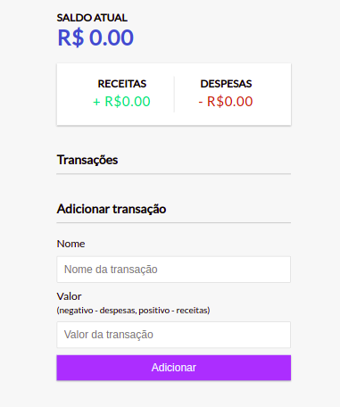

# javascript-dom-tasks  

### Finance Management  

Finance Management is a application to management of the your finances using only javascript, css and HTML. Without frameworks as React or Angular.  

### features:  

form to add new transaction in website
listing of products w/ scroll and without repetitions  
renderization of the values: income, expenses and total  

